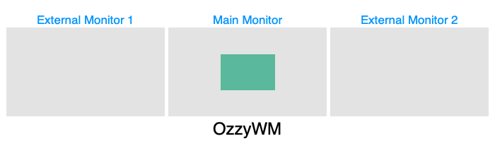

# OzzyWM - Hammerspoon Window Manager Plugin

As a huge fan of hammerspoon, this is my window manager plugin.

## Installation

Download spoon file from [releases](https://github.com/ozguncagri/OzzyWM/releases) page and install it with double clicking it, then open your hammerspoon config and add this line to it;

```lua
hs.loadSpoon("OzzyWM")
```

then reload your config; you are ready to go.

## Key Symbol Legend

| Symbol | Keyboar Key  |
|:--:|:--|
| ⇧ | Shift |
| ⌃ | Control |
| ⌥ | Option |
| ⌘ | Command |
| ↑ | Up Arrow |
| → | Right Arrow |
| ↓ | Down Arrow |
| ← | Left Arrow |
| ⇥ | Tab Key |
| ␣ | Space Kay |

---

## Alternate App Switcher

| Hotkey | Operation  |
|:--:|:--|
| ⌃ + ⌥ + ⌘ + ⇥ | Next Window |
| ⇧ + ⌃ + ⌥ + ⌘ + ⇥ | Previous Window |

## Numerical Window Docker



| Hotkey | Operation  |
|:--:|:--|
| ⌃ + ⌥ + ⌘ + 1 | Dock window to left side and resize it to 1/8 |
| ⌃ + ⌥ + ⌘ + 2 | Dock window to left side and resize it to 2/8 |
| ⌃ + ⌥ + ⌘ + 3 | Dock window to left side and resize it to 3/8 |
| ⌃ + ⌥ + ⌘ + 4 | Dock window to left side and resize it to 4/8 |
| ⌃ + ⌥ + ⌘ + 5 | Dock window to left side and resize it to 5/8 |
| ⌃ + ⌥ + ⌘ + 6 | Dock window to left side and resize it to 6/8 |
| ⌃ + ⌥ + ⌘ + 7 | Dock window to left side and resize it to 7/8 |
| ⌃ + ⌥ + ⌘ + 8 | Window becomes full screen |
| ⇧ + ⌃ + ⌥ + ⌘ + 1 | Dock window to right side and resize it to 1/8 |
| ⇧ + ⌃ + ⌥ + ⌘ + 2 | Dock window to right side and resize it to 2/8 |
| ⇧ + ⌃ + ⌥ + ⌘ + 3 | Dock window to right side and resize it to 3/8 |
| ⇧ + ⌃ + ⌥ + ⌘ + 4 | Dock window to right side and resize it to 4/8 |
| ⇧ + ⌃ + ⌥ + ⌘ + 5 | Dock window to right side and resize it to 5/8 |
| ⇧ + ⌃ + ⌥ + ⌘ + 6 | Dock window to right side and resize it to 6/8 |
| ⇧ + ⌃ + ⌥ + ⌘ + 7 | Dock window to right side and resize it to 7/8 |
| ⇧ + ⌃ + ⌥ + ⌘ + 8 | Window becomes full screen |

## Window Zoomer

| Hotkey | Operation  |
|:--:|:--|
| ⇧ + ⌃ + ⌥ + ⌘ + ␣ | Toggles the zoom state of the window |

## Window Slider


| Hotkey | Operation  |
|:--:|:--|
| ⌃ + ⌥ + ⌘ + ↑ | Slide window to top edge of the screen without resizing it |
| ⌃ + ⌥ + ⌘ + → | Slide window to right edge of the screen without resizing it |
| ⌃ + ⌥ + ⌘ + ↓ | Slide window to bottom edge of the screen without resizing it |
| ⌃ + ⌥ + ⌘ + ← | Slide window to left edge of the screen without resizing it |
| ⌃ + ⌥ + ⌘ + ␣ | Slide window middle of the screen in x and y axis |

## Window Snapper

Pressing hotkeys again shrinks down the window to quarter of the side you press. If you press other arrow hotkeys (except opposite arrow) the window shrinks down to the corners of the screen.


| Hotkey | Operation  |
|:--:|:--|
| ⇧ + ⌃ + ⌥ + ⌘ + ↑ | Snap window to top half of the screen |
| ⇧ + ⌃ + ⌥ + ⌘ + → | Snap window to right half side of the screen |
| ⇧ + ⌃ + ⌥ + ⌘ + ↓ | Snap window to bottom half of the screen |
| ⇧ + ⌃ + ⌥ + ⌘ + ← | Snap window to left half side of the screen |
